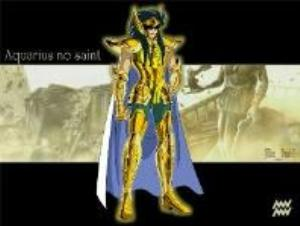



## PDF Printer Class

### Description

The purpose of this class is to generate PDF file without ocx , dll or virtual printer.

Just using differents methods and properties to build dynamically PDF objects to generate PDF file.

Codes of methods and properties has been build about Adobe PDF Specification (free specification download from Adobe).

About images, Jpeg images are only supported.

PDF files are not compressed.

Bookmarks are supported in this class.

Only True Type Fonts are supported (if the Adobe Font Metrics File is in app Fonts dir).
 
### More Info
 

             |
---                |---
**Submitted On**   |2005-08-06 00:37:34
**By**             |[NeO78](https://github.com/Planet-Source-Code/PSCIndex/blob/master/ByAuthor/neo78.md)
**Level**          |Intermediate
**User Rating**    |4.9 (227 globes from 46 users)
**Compatibility**  |VB 6\.0
**Category**       |[Files/ File Controls/ Input/ Output](https://github.com/Planet-Source-Code/PSCIndex/blob/master/ByCategory/files-file-controls-input-output__1-3.md)
**World**          |[Visual Basic](https://github.com/Planet-Source-Code/PSCIndex/blob/master/ByWorld/visual-basic.md)
**Archive File**   |[PDF\_Printe1924378162005\.zip](https://github.com/Planet-Source-Code/neo78-pdf-printer-class__1-61936/archive/master.zip)

